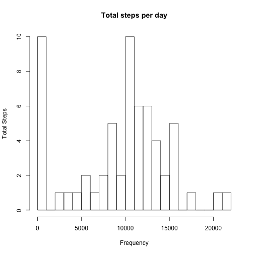
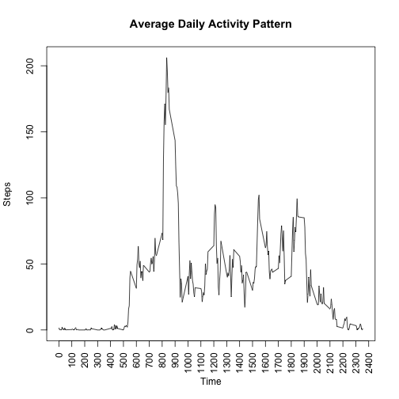
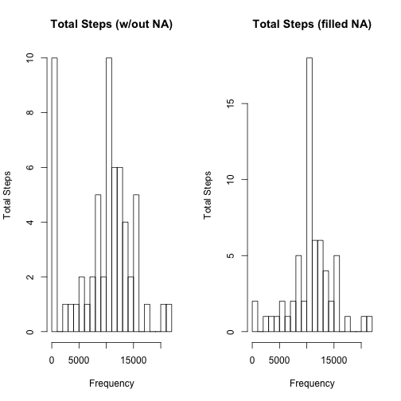
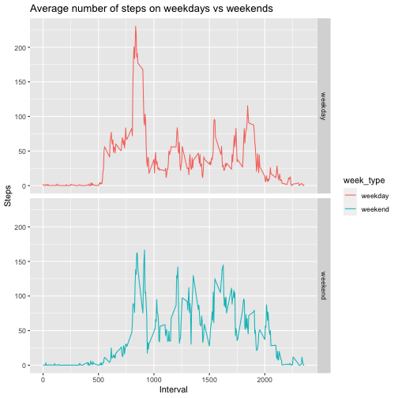

## Loading and preprocessing the data


```r
df <- read.table("activity.csv", sep = ",", na.strings = "NA", header = TRUE)
df$date <- as.Date(df$date, "%Y-%m-%d")
```

## What is mean total number of steps taken per day?

As instructed, missing values are ignored.

1. Calculate the total number of steps taken per day


```r
sum_steps <- with(df,tapply(steps,date,sum,na.rm=TRUE))
sum_steps
```

```
## 2012-10-01 2012-10-02 2012-10-03 2012-10-04 2012-10-05 2012-10-06 2012-10-07 2012-10-08 2012-10-09 2012-10-10 
##          0        126      11352      12116      13294      15420      11015          0      12811       9900 
## 2012-10-11 2012-10-12 2012-10-13 2012-10-14 2012-10-15 2012-10-16 2012-10-17 2012-10-18 2012-10-19 2012-10-20 
##      10304      17382      12426      15098      10139      15084      13452      10056      11829      10395 
## 2012-10-21 2012-10-22 2012-10-23 2012-10-24 2012-10-25 2012-10-26 2012-10-27 2012-10-28 2012-10-29 2012-10-30 
##       8821      13460       8918       8355       2492       6778      10119      11458       5018       9819 
## 2012-10-31 2012-11-01 2012-11-02 2012-11-03 2012-11-04 2012-11-05 2012-11-06 2012-11-07 2012-11-08 2012-11-09 
##      15414          0      10600      10571          0      10439       8334      12883       3219          0 
## 2012-11-10 2012-11-11 2012-11-12 2012-11-13 2012-11-14 2012-11-15 2012-11-16 2012-11-17 2012-11-18 2012-11-19 
##          0      12608      10765       7336          0         41       5441      14339      15110       8841 
## 2012-11-20 2012-11-21 2012-11-22 2012-11-23 2012-11-24 2012-11-25 2012-11-26 2012-11-27 2012-11-28 2012-11-29 
##       4472      12787      20427      21194      14478      11834      11162      13646      10183       7047 
## 2012-11-30 
##          0
```

2. Make a histogram of the total number of steps taken each day

```r
hist(sum_steps,breaks=20,ann=FALSE)
title(main="Total steps per day",xlab="Frequency",ylab="Total Steps")
```



3. Calculate and report the mean and median of the total number of steps taken per day

```r
sprintf("The mean steps across all days is %g", mean(sum_steps))
```

```
## [1] "The mean steps across all days is 9354.23"
```

```r
sprintf("The median steps across all days is %g", median(sum_steps))
```

```
## [1] "The median steps across all days is 10395"
```

## What is the average daily activity pattern?

1. Make a time series plot (i.e. \color{red}{\verb|type = "l"|}type = "l") of the 5-minute interval (x-axis) and the average number of steps taken, averaged across all days (y-axis)


```r
avg_steps <- with(df,tapply(steps,interval,mean,na.rm=TRUE))
unique_intervals <- as.vector(unique(df$interval))
cbind(avg_steps,unique_intervals)
```

```
##        avg_steps unique_intervals
## 0      1.7169811                0
## 5      0.3396226                5
## 10     0.1320755               10
## 15     0.1509434               15
## 20     0.0754717               20
## 25     2.0943396               25
## 30     0.5283019               30
## 35     0.8679245               35
## 40     0.0000000               40
## 45     1.4716981               45
## 50     0.3018868               50
## 55     0.1320755               55
## 100    0.3207547              100
## 105    0.6792453              105
## 110    0.1509434              110
## 115    0.3396226              115
## 120    0.0000000              120
## 125    1.1132075              125
## 130    1.8301887              130
## 135    0.1698113              135
## 140    0.1698113              140
## 145    0.3773585              145
## 150    0.2641509              150
## 155    0.0000000              155
## 200    0.0000000              200
## 205    0.0000000              205
## 210    1.1320755              210
## 215    0.0000000              215
## 220    0.0000000              220
## 225    0.1320755              225
## 230    0.0000000              230
## 235    0.2264151              235
## 240    0.0000000              240
## 245    0.0000000              245
## 250    1.5471698              250
## 255    0.9433962              255
## 300    0.0000000              300
## 305    0.0000000              305
## 310    0.0000000              310
## 315    0.0000000              315
## 320    0.2075472              320
## 325    0.6226415              325
## 330    1.6226415              330
## 335    0.5849057              335
## 340    0.4905660              340
## 345    0.0754717              345
## 350    0.0000000              350
## 355    0.0000000              355
## 400    1.1886792              400
## 405    0.9433962              405
## 410    2.5660377              410
## 415    0.0000000              415
## 420    0.3396226              420
## 425    0.3584906              425
## 430    4.1132075              430
## 435    0.6603774              435
## 440    3.4905660              440
## 445    0.8301887              445
## 450    3.1132075              450
## 455    1.1132075              455
## 500    0.0000000              500
## 505    1.5660377              505
## 510    3.0000000              510
## 515    2.2452830              515
## 520    3.3207547              520
## 525    2.9622642              525
## 530    2.0943396              530
## 535    6.0566038              535
## 540   16.0188679              540
## 545   18.3396226              545
## 550   39.4528302              550
## 555   44.4905660              555
## 600   31.4905660              600
## 605   49.2641509              605
## 610   53.7735849              610
## 615   63.4528302              615
## 620   49.9622642              620
## 625   47.0754717              625
## 630   52.1509434              630
## 635   39.3396226              635
## 640   44.0188679              640
## 645   44.1698113              645
## 650   37.3584906              650
## 655   49.0377358              655
## 700   43.8113208              700
## 705   44.3773585              705
## 710   50.5094340              710
## 715   54.5094340              715
## 720   49.9245283              720
## 725   50.9811321              725
## 730   55.6792453              730
## 735   44.3207547              735
## 740   52.2641509              740
## 745   69.5471698              745
## 750   57.8490566              750
## 755   56.1509434              755
## 800   73.3773585              800
## 805   68.2075472              805
## 810  129.4339623              810
## 815  157.5283019              815
## 820  171.1509434              820
## 825  155.3962264              825
## 830  177.3018868              830
## 835  206.1698113              835
## 840  195.9245283              840
## 845  179.5660377              845
## 850  183.3962264              850
## 855  167.0188679              855
## 900  143.4528302              900
## 905  124.0377358              905
## 910  109.1132075              910
## 915  108.1132075              915
## 920  103.7169811              920
## 925   95.9622642              925
## 930   66.2075472              930
## 935   45.2264151              935
## 940   24.7924528              940
## 945   38.7547170              945
## 950   34.9811321              950
## 955   21.0566038              955
## 1000  40.5660377             1000
## 1005  26.9811321             1005
## 1010  42.4150943             1010
## 1015  52.6603774             1015
## 1020  38.9245283             1020
## 1025  50.7924528             1025
## 1030  44.2830189             1030
## 1035  37.4150943             1035
## 1040  34.6981132             1040
## 1045  28.3396226             1045
## 1050  25.0943396             1050
## 1055  31.9433962             1055
## 1100  31.3584906             1100
## 1105  29.6792453             1105
## 1110  21.3207547             1110
## 1115  25.5471698             1115
## 1120  28.3773585             1120
## 1125  26.4716981             1125
## 1130  33.4339623             1130
## 1135  49.9811321             1135
## 1140  42.0377358             1140
## 1145  44.6037736             1145
## 1150  46.0377358             1150
## 1155  59.1886792             1155
## 1200  63.8679245             1200
## 1205  87.6981132             1205
## 1210  94.8490566             1210
## 1215  92.7735849             1215
## 1220  63.3962264             1220
## 1225  50.1698113             1225
## 1230  54.4716981             1230
## 1235  32.4150943             1235
## 1240  26.5283019             1240
## 1245  37.7358491             1245
## 1250  45.0566038             1250
## 1255  67.2830189             1255
## 1300  42.3396226             1300
## 1305  39.8867925             1305
## 1310  43.2641509             1310
## 1315  40.9811321             1315
## 1320  46.2452830             1320
## 1325  56.4339623             1325
## 1330  42.7547170             1330
## 1335  25.1320755             1335
## 1340  39.9622642             1340
## 1345  53.5471698             1345
## 1350  47.3207547             1350
## 1355  60.8113208             1355
## 1400  55.7547170             1400
## 1405  51.9622642             1405
## 1410  43.5849057             1410
## 1415  48.6981132             1415
## 1420  35.4716981             1420
## 1425  37.5471698             1425
## 1430  41.8490566             1430
## 1435  27.5094340             1435
## 1440  17.1132075             1440
## 1445  26.0754717             1445
## 1450  43.6226415             1450
## 1455  43.7735849             1455
## 1500  30.0188679             1500
## 1505  36.0754717             1505
## 1510  35.4905660             1510
## 1515  38.8490566             1515
## 1520  45.9622642             1520
## 1525  47.7547170             1525
## 1530  48.1320755             1530
## 1535  65.3207547             1535
## 1540  82.9056604             1540
## 1545  98.6603774             1545
## 1550 102.1132075             1550
## 1555  83.9622642             1555
## 1600  62.1320755             1600
## 1605  64.1320755             1605
## 1610  74.5471698             1610
## 1615  63.1698113             1615
## 1620  56.9056604             1620
## 1625  59.7735849             1625
## 1630  43.8679245             1630
## 1635  38.5660377             1635
## 1640  44.6603774             1640
## 1645  45.4528302             1645
## 1650  46.2075472             1650
## 1655  43.6792453             1655
## 1700  46.6226415             1700
## 1705  56.3018868             1705
## 1710  50.7169811             1710
## 1715  61.2264151             1715
## 1720  72.7169811             1720
## 1725  78.9433962             1725
## 1730  68.9433962             1730
## 1735  59.6603774             1735
## 1740  75.0943396             1740
## 1745  56.5094340             1745
## 1750  34.7735849             1750
## 1755  37.4528302             1755
## 1800  40.6792453             1800
## 1805  58.0188679             1805
## 1810  74.6981132             1810
## 1815  85.3207547             1815
## 1820  59.2641509             1820
## 1825  67.7735849             1825
## 1830  77.6981132             1830
## 1835  74.2452830             1835
## 1840  85.3396226             1840
## 1845  99.4528302             1845
## 1850  86.5849057             1850
## 1855  85.6037736             1855
## 1900  84.8679245             1900
## 1905  77.8301887             1905
## 1910  58.0377358             1910
## 1915  53.3584906             1915
## 1920  36.3207547             1920
## 1925  20.7169811             1925
## 1930  27.3962264             1930
## 1935  40.0188679             1935
## 1940  30.2075472             1940
## 1945  25.5471698             1945
## 1950  45.6603774             1950
## 1955  33.5283019             1955
## 2000  19.6226415             2000
## 2005  19.0188679             2005
## 2010  19.3396226             2010
## 2015  33.3396226             2015
## 2020  26.8113208             2020
## 2025  21.1698113             2025
## 2030  27.3018868             2030
## 2035  21.3396226             2035
## 2040  19.5471698             2040
## 2045  21.3207547             2045
## 2050  32.3018868             2050
## 2055  20.1509434             2055
## 2100  15.9433962             2100
## 2105  17.2264151             2105
## 2110  23.4528302             2110
## 2115  19.2452830             2115
## 2120  12.4528302             2120
## 2125   8.0188679             2125
## 2130  14.6603774             2130
## 2135  16.3018868             2135
## 2140   8.6792453             2140
## 2145   7.7924528             2145
## 2150   8.1320755             2150
## 2155   2.6226415             2155
## 2200   1.4528302             2200
## 2205   3.6792453             2205
## 2210   4.8113208             2210
## 2215   8.5094340             2215
## 2220   7.0754717             2220
## 2225   8.6981132             2225
## 2230   9.7547170             2230
## 2235   2.2075472             2235
## 2240   0.3207547             2240
## 2245   0.1132075             2245
## 2250   1.6037736             2250
## 2255   4.6037736             2255
## 2300   3.3018868             2300
## 2305   2.8490566             2305
## 2310   0.0000000             2310
## 2315   0.8301887             2315
## 2320   0.9622642             2320
## 2325   1.5849057             2325
## 2330   2.6037736             2330
## 2335   4.6981132             2335
## 2340   3.3018868             2340
## 2345   0.6415094             2345
## 2350   0.2264151             2350
## 2355   1.0754717             2355
```

```r
plot(names(avg_steps),avg_steps,type="l",ann=FALSE,xaxt="n")
axis(1, xaxp=c(0, 2400, 24), las=2)
title(main="Average Daily Activity Pattern",xlab="Time",ylab="Steps")
```



2. Which 5-minute interval, on average across all the days in the dataset, contains the maximum number of steps?


```r
sprintf("The 5 minute interval in which the average steps across all the days in the dataset is %s to %i",names(which.max(avg_steps)),as.integer(names(which.max(avg_steps)))+5)
```

```
## [1] "The 5 minute interval in which the average steps across all the days in the dataset is 835 to 840"
```

## Imputing missing values

1. Calculate and report the total number of missing values in the dataset (i.e. the total number of rows with \color{red}{\verb|NA|}NAs)


```r
sprintf("The total number of missing values in the dataset is %g", sum(is.na(df$steps)))
```

```
## [1] "The total number of missing values in the dataset is 2304"
```

2. Devise a strategy for filling in all of the missing values in the dataset. The strategy does not need to be sophisticated. For example, you could use the mean/median for that day, or the mean for that 5-minute interval, etc.

The strategy will be to fill in the missing values with the mean for that interval across all days.

3. Create a new dataset that is equal to the original dataset but with the missing data filled in.

```r
df2 <- df
aggregated_steps <- aggregate(steps~interval, na.omit(df), mean)
df2$steps <- ifelse(is.na(df2$steps) == TRUE, aggregated_steps$steps[aggregated_steps$interval %in% df2$interval], df2$steps)
```

4. Make a histogram of the total number of steps taken each day and Calculate and report the mean and median total number of steps taken per day. Do these values differ from the estimates from the first part of the assignment? What is the impact of imputing missing data on the estimates of the total daily number of steps?

```r
par(mfrow=c(1,2))
hist(sum_steps,breaks=20,ann=FALSE)
title(main="Total Steps (w/out NA)",xlab="Frequency",ylab="Total Steps")
df2_agg <- aggregate(steps ~ date, df2, sum)
hist(df2_agg$steps,breaks=20,ann=FALSE)
title(main="Total Steps (filled NA)",xlab="Frequency",ylab="Total Steps")
```



## Are there differences in activity patterns between weekdays and weekends?

1. Create a new factor variable in the dataset with two levels – “weekday” and “weekend” indicating whether a given date is a weekday or weekend day.

```r
df2_week <- df2


df2_week$day <- as.factor(weekdays(as.Date(df2_week$date)))
df2_week$week_type <- as.factor(ifelse(df2_week$day == "Saturday" | df2_week$day == "Sunday", "weekend", "weekday"))
```
2. Make a panel plot containing a time series plot (i.e. \color{red}{\verb|type = "l"|}type = "l") of the 5-minute interval (x-axis) and the average number of steps taken, averaged across all weekday days or weekend days (y-axis). See the README file in the GitHub repository to see an example of what this plot should look like using simulated data.

```r
df2_week_agg <- aggregate(steps ~ interval + week_type, df2_week, mean)
ggplot(data=df2_week_agg, aes(color=week_type, x=interval, y=steps,group=1)) + geom_line()+labs(x="Interval", y="Steps", title="Average number of steps on weekdays vs weekends") + facet_grid(week_type ~ .)
```


Note that the `echo = FALSE` parameter was added to the code chunk to prevent printing of the R code that generated the plot.
